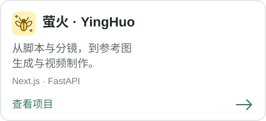
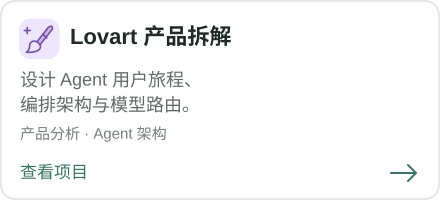
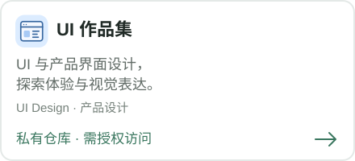

  <samp>
    <b>李思婷 · LISITING</b>  
      
    <a href="https://maoling-ai-ops-dashboard.a1984114944.chatgpt.site/">贸灵</a>
    &nbsp;·&nbsp;
    <a href="https://github.com/tingman2?tab=repositories">项目</a>
    &nbsp;·&nbsp;
    <a href="https://mp.weixin.qq.com/s/u0edgVBAHEa7JZJWYJEmIg">微信公众号</a>
    &nbsp;·&nbsp;
    <a href="https://xhslink.cn/o/4ObGu88exMA">小红书</a>
    &nbsp;·&nbsp;
    <a href="https://github.com/tingman-ship-t/tingman-ship-t/issues">联系我</a>
  </samp>

   
  扫码关注微信公众号 · 点击二维码阅读文章

---

## 关于我

我是李思婷。比起追最新的模型，我更在意一个问题：技术能力进来之后，用户的生活或工作到底有没有因此变好。所以我习惯从一个小需求切进去，亲手做原型、跑真实反馈，再决定值不值得继续投入。

我感兴趣的，是那些“看起来很酷”和“真的有人用”之间的判断：这件事值不值得解决、AI 该放在哪一环、人还要不要介入，以及怎么知道自己做对了。这里记录我的项目、踩过的坑，和一些还没想清楚的思考。

## 精选项目

## 微信公众号文章

- [同一个 AI，换个 Harness 就像换了个脑子？](https://mp.weixin.qq.com/s/u0edgVBAHEa7JZJWYJEmIg)
- [AI 情感军师产品有市场吗，孙宇晨替所有人试了一次](https://mp.weixin.qq.com/s/BFqfQJxjoP_gAFh4rO9V1Q)
- [AI 短剧出海记：出海到底赚谁的钱？美国人付钱，东南亚人追更，日本人挑脸](https://mp.weixin.qq.com/s/Is_1665i1geastYoZ9qTfw)
- [AI 先让 UI 设计师失业，具身智能又盯上了谁](https://mp.weixin.qq.com/s/3F45wqljOuq2AJudpwMKmw)
- [GPT-6 发布了：上岗 3 天，几分钟翻完 41 份文件，还做了 3 款游戏，究竟可以用来做什么？](https://mp.weixin.qq.com/s/jTiXDzucgU52EWsg4wOxyw)

  让 AI 真正进入工作流，而不只是停留在演示里。

## Social & Contact / 社媒与联系

分享 AI 产品探索、技术观察与创作实践，欢迎关注与交流。

| 平台 | 入口 |
| --- | --- |
| 小红书 | [访问我的小红书](https://xhslink.cn/o/4ObGu88exMA) |
| 人人都是产品经理 | [查看我的文章](https://www.woshipm.com/u/1686773) |
| 个人网站 | [李思婷 · LISITING](https://lisiting-personal-portfolio.a1984114944.chatgpt.site/) |
| 邮箱 | [a1984114944@gmail.com](mailto:a1984114944@gmail.com) |

